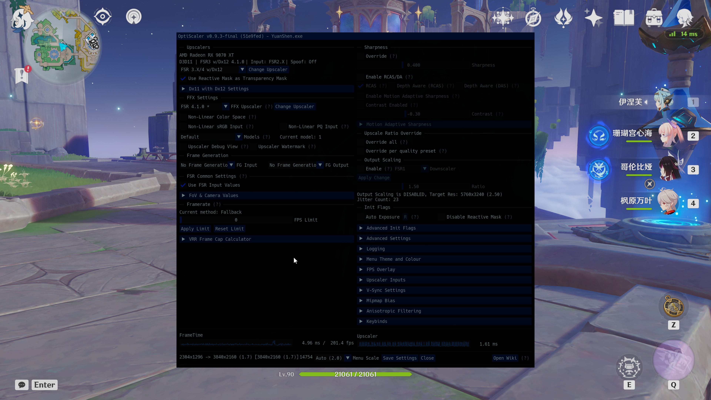
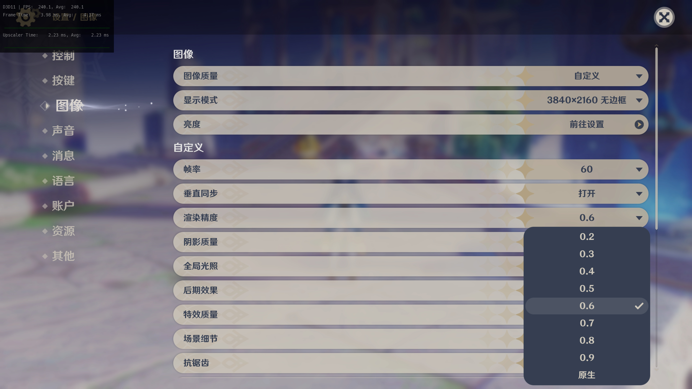

# Genshin FSR Bridge

面向原神 Windows DX11 客户端的 FSR2 ABI 桥接 DLL。它在游戏进程中提供标准 FSR2 导出，并把游戏的上采样调用转接给外部兼容实现，例如 OptiScaler。

本仓库同时包含 `AntiPlayerMosaic/` 子项目。它是独立构建的原神马赛克修复与 UID 隐藏插件，具体用法见该目录的 README。

英文说明见 [README_EN.md](README_EN.md)。

## 支持范围与风险声明

- 目标支持原神中国服与全球服的 Windows DX11 客户端。
- 仅在 `6.7（「月之八」）`测试；不保证与其他游戏版本或客户端环境兼容。
- 本项目与 `HoYoverse`、`miHoYo`、`《原神》`及 `Genshin Impact` 均无关联，也未获得其认可或授权；相关名称与商标归其各自权利人所有。
- 使用第三方 DLL、注入器、Mod 或图形插件可能违反游戏规则，并可能导致账号限制或封禁。使用者须自行评估风险并承担全部责任。

## 效果演示





## 帧生成分支

`frame-generation` 分支中的帧生成功能基于 `OptiScaler 0.10.0-pre1` 构建。低于 `0.10.0-pre1` 的 OptiScaler 不支持该帧生成功能。

## Lite 发布包

`GenshinOneClick/` 包含 Lite 安装器的完整脚本、默认配置、官方 ReShade Add-on DLL 和 HDR 着色器。FPS Unlocker 与 OptiScaler 不随 Lite 包或本仓库分发，安装器会从其官方来源下载或要求用户手动选择。

两个自有 DLL 是编译产物，不提交到仓库。要生成与 GitHub Actions 相同的 Lite ZIP，请在 Windows 上运行：

```powershell
powershell -ExecutionPolicy Bypass -File .\Build-OnlineInstaller.ps1 -Configuration Release
```

构建结果位于 `dist\原神解帧FSR插件包Lite_v*.zip` 和 `dist\芙芙启动器插件包Lite_v*.zip`。GitHub Actions 可从 Actions 页面手动触发，并将两个 ZIP 上传为 `GenshinOneClick-Lite-Packages` Artifact；勾选发布选项并填写版本标签时，会以 `GenshinFSRBridge.Lite_v版本号.zip` 和 `FuFuLauncherPlugin.Lite_v版本号.zip` 创建或更新对应 GitHub Release。

## 功能

- 通过 DX11 设备与上下文拦截获取原神的 FSR2 调用时机。
- 提供标准 FSR2 导出，使外部超分工具可以识别 FSR2 接口。
- 为外部处理器准备颜色、深度、运动向量、抖动和历史资源。
- 将游戏渲染精度菜单扩展为 `0.2–0.9 + 原生`；`原生` 档位为游戏原本的 `1.0` 渲染精度。
- 运行时日志默认写入 DLL 同目录的 `Dx11FsrBridge.log`，用于排查加载与 Hook 状态。

## 仓库结构

- 仓库根目录：FSR Bridge 源码、配置与构建文件。
- `AntiPlayerMosaic/`：反虚化、隐藏 UID 与水下马赛克修复插件。
- `third_party/`：Bridge 的构建依赖及其原始声明。

## 使用方法

从 [Releases](https://github.com/AizawaHikaru233/genshin_fsr_brigde/releases) 下载压缩包，解压后运行 `一键配置.bat` 并根据提示安装。英语界面可运行 `GenshinFSRBridgeTools.bat`；也可在安装器主菜单中随时切换中文或 English，选择会自动保存。脚本会按环境自动获取 [Genshin FPS Unlock](https://github.com/34736384/genshin-fps-unlock/releases)、[NVIDIA DLSS 超分组件（`nvngx_dlss.dll`）](https://github.com/NVIDIA-RTX/Streamline/releases) 和 [OptiScaler](https://github.com/optiscaler/OptiScaler/releases)，补全运行环境。
游戏内必须启用 `FSR2` 抗锯齿，渲染精度需低于 `1`

`Dx11FsrBridge.dll` 本身不执行 FSR、DLSS、XeSS 或其他超分算法。它只向外部工具暴露标准 FSR2 接口，并将游戏的 DX11 上采样调用转接到该接口。

也可以使用其他 DLL 注入工具，但必须保证它支持稳定的按序加载。

推荐加载顺序：

1. `Dx11FsrBridge.dll`
2. `OptiScaler.dll`
3. `AntiPlayerMosaic.dll`（可选）
4. `ReShade64.dll`（可选）

仅使用超分桥接时，前两项必须保持该顺序：Bridge 先加载，随后由 [OptiScaler](https://github.com/optiscaler/OptiScaler)（或同类工具）在启动时扫描标准 FSR2 导出并接管。Bridge 不直接加载、修改或捆绑 OptiScaler；后端选择、FSR3/FSR4 模型和其他 OptiScaler 配置均由用户自己的工具安装负责。

OptiScaler 和 ReShade 的运行配置位于各自组件目录。OptiScaler 的 DLL 与日志路径、ReShade 的着色器、纹理、Preset 和截图路径均使用相对路径，避免安装目录含中文时被第三方配置保存逻辑错误转码。只有游戏目录中用于定位外置 ReShade 目录的 `[INSTALL] BasePath` 在跨目录或跨盘安装时必须使用动态生成的绝对路径。

## 构建

需要 Visual Studio 2022（含 C++ 桌面开发组件）、Windows SDK 和 CMake 3.20 或更新版本。

```powershell
cmake -S .\Dx11FsrBridge -B .\build-package-bridge -G "Visual Studio 17 2022" -A x64 `
  -DDX11FSRBRIDGE_RELEASE_RUNTIME=ON `
  -DDX11FSRBRIDGE_ENABLE_FSR2_TRANSLATION_EXPERIMENTAL=ON
cmake --build .\build-package-bridge --config Release
```

生成的 DLL 与 `Dx11FsrBridge.release.ini` 会位于 `build-package-bridge\Release`。发布配置需要仓库内的 `Dx11FsrBridge\third_party` 目录，其中包含 FSR2 兼容 ABI 头文件和 Microsoft Detours 构建依赖。

`DX11FSRBRIDGE_ENABLE_FSR31_EXPERIMENTAL`、`DX11FSRBRIDGE_ENABLE_OPTISCALER_NGX_EXPERIMENTAL` 等 CMake 选项仅用于实验，不属于正式运行链路。

## 日志与问题反馈

Bridge、OptiScaler 和反虚化组件默认会保留错误日志。每次重新运行会覆盖上一轮日志。
遇到游戏无法启动、FSR 无法激活、切换超分后闪退或其他异常时，请在复现后不要再次启动游戏，并提供：

1. `payload/Bridge/Dx11FsrBridge.log` (必须)
2. `payload/OptiScaler/OptiScaler.log` (必须)
3. `payload/OptiScaler/OptiScaler.ini`
4. `payload/ReShade/ReShade.log`（涉及 ReShade 时）
5. `payload/AntiPlayerMosaic/AntiPlayerMosaic.log`（涉及反虚化、UID 或水下马赛克时）
6. 芙芙插件目录下的 `FSR-Bridge-Plugin.log`（使用芙芙启动器插件时）
7. 显卡型号、游戏版本、异常发生阶段和所选超分模式

需要进一步排查时，可临时将 `OptiScaler.ini` 中 `Log` 下的 `LogLevel` 改为 `1（Debug）`或 `0（Trace）`但诊断结束后应恢复正式配置以避免额外开销。
不要把游戏账号、登录信息或包含个人信息的截图提交到公开 Issue。

## 第三方组件

- FSR2 ABI 头文件与 Microsoft Detours 仅作为构建依赖，保留各自原始许可证与声明。
- OptiScaler 是独立项目：<https://github.com/optiscaler/OptiScaler>。
- Lite 资源包含官方 ReShade Add-on DLL（BSD-3-Clause）、[剪刀妹丽丽](https://www.bilibili.com/video/av116861345793770/) 授权再分发的 RenoDX Add-on，以及 Lilium HDR 着色器（GPL-3.0）。RenoDX 的唯一归档源位于 `RenoDX-Genshin/`，打包时会自动同步到 ReShade 载荷；各自许可证与授权记录位于资源目录。
- 本项目不包含 NVIDIA DLSS、AMD FSR SDK 或 OptiScaler 运行时二进制文件。

## 许可证

本项目采用 [GPL-3.0-or-later](Dx11FsrBridge/LICENSE)。你可以使用、修改和再分发代码；分发修改版本时必须同时提供对应完整源码，并以 GPL-3.0-or-later 发布。
