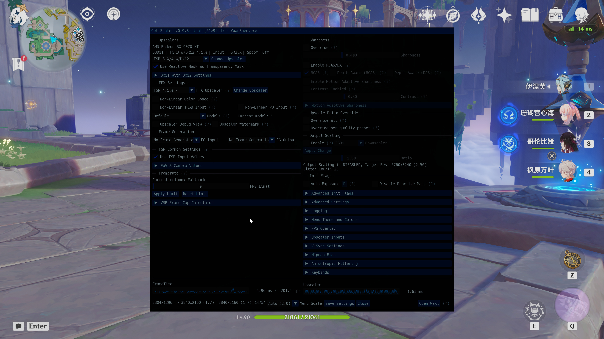
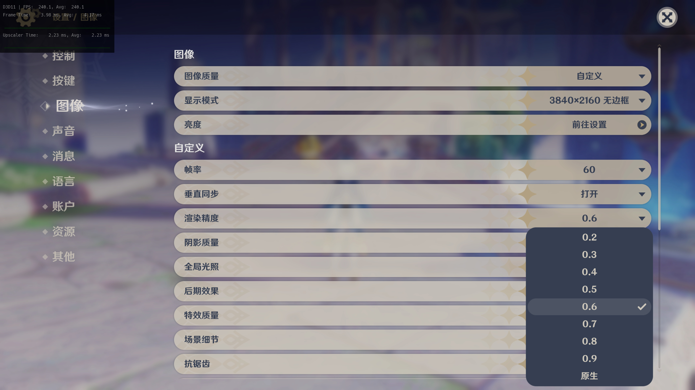

# Genshin FSR Bridge

面向原神 Windows DX11 客户端的图形插件。它独立 hook 游戏原生 FSR2 调用，并转接到 AMD FFX12 官方 SDK 实现超分：在支持的显卡上直接提供 FSR4/FSR3/FSR2，不依赖 OptiScaler 等外部插件；接入 OptiScaler 后可以进一步扩展 DLSS/XeSS/FSR4 INT8 等超分类型。

本仓库同时包含 `AntiPlayerMosaic/` 与 `TextureLoader/` 两个子项目：前者是独立构建的原神马赛克修复与 UID 隐藏插件；后者是 3DMigoto 兼容的纹理替换 / Mod 加载器（支持 DDS 与 DirectStorage GPU 解压的 GDDS）。用法分别见对应目录的 README 与 NOTICE。

英文说明见 [README_EN.md](README_EN.md)。

## 支持范围与风险声明

- 目标支持原神中国服与全球服的 Windows DX11 客户端。
- 已适配原神 `7.0` 并实测通过。**新版本游戏更新后需要重新验证**：本项目 hook 的是
  游戏内部的 FSR2 调用与 il2cpp 方法（含 RVA 与序言字节匹配），游戏更新可能改变这些
  内部结构。桥会在特征不匹配时放弃 hook 并回退（不会崩溃），但**超分可能随之失效**，
  需等本项目跟进适配。详见 [GPU 支持与 N 卡注意事项](#gpu-支持与-n-卡注意事项)。
- 功能与硬件前提：FSR4/FSR3/FSR2 的实际可用档位取决于**显卡型号与驱动版本**
  （例如 FSR4 需要 RDNA4 及对应驱动）。文中"在支持的显卡上"均指该节所列范围，
  请先对照确认自己的显卡在列。
- 本项目与 `HoYoverse`、`miHoYo`、`《原神》`及 `Genshin Impact` 均无关联，也未获得其认可或授权；相关名称与商标归其各自权利人所有。
- 使用第三方 DLL、注入器、Mod 或图形插件可能违反游戏规则，并可能导致账号限制或封禁。使用者须自行评估风险并承担全部责任。

## 效果演示





## 帧生成分支

`frame-generation` 分支中的帧生成功能基于 `OptiScaler 0.10.0-pre1` 构建。低于 `0.10.0-pre1` 的 OptiScaler 不支持该帧生成功能。

## 发布包

包由构建脚本直接组装：安装器脚本位于 `tools/FpsUnlockInstaller/`，反馈与组件清单位于 `assets/FpsUnlockPackage/`，运行资源和默认配置位于 `SharedResources/`。GitHub 发布包不会内置 NVIDIA DLSS 组件与 ReShade 二进制，安装时由脚本从各自官方上游获取（DLSS 来自 NVIDIA Streamline、ReShade 来自 reshade.me）；本地分发包需要自行补齐相应组件。

要生成 GitHub 发布包，请在 Windows 上运行：

```powershell
powershell -ExecutionPolicy Bypass -File .\Build-OnlineInstaller.ps1 -Configuration Release -GithubOnly
```

构建结果位于 `dist\原神解帧FSR插件包_v*.7z`，GitHub 发布目录生成 `dist\github-release\GenshinFSRBridge_v*.zip`。GitHub Actions 只构建和发布这个 GitHub 发布包，不生成芙芙包。
## 芙芙启动器插件包源码与本地构建

`FufuGraphicsPlugin/` 提供芙芙启动器插件的源码、配置模板以及商城/本地测试 Lua 安装脚本；仓库不提交芙芙启动器插件二进制包。本地构建前先运行 `tools/Update-UpstreamComponents.ps1` 获取上游组件基线（OptiScaler 固定 v0.9.4，DLSS、ReShade、FPS Unlocker 获取各自最新正式版并做 SHA-256 校验），再运行：

```powershell
powershell -ExecutionPolicy Bypass -File .\tools\Update-UpstreamComponents.ps1 -WorkspaceRoot .
powershell -ExecutionPolicy Bypass -File .\Build-OnlineInstaller.ps1 -Configuration Release
```

也可以让构建脚本先自动更新上游组件再打包（`-FetchUpstream`）。芙芙启动器插件包仅写入本地 `dist\FSR-Bridge-Plugin.v*.zip`，不会进入 GitHub Actions 或 GitHub Release。

## 功能

- 通过 DX11 设备与上下文拦截获取原神的 FSR2 调用时机。
- 为 FFX12 SDK 准备颜色、深度、运动向量、抖动和历史资源，并转接超分 dispatch。
- 按显卡能力自动匹配 FSR 系列（FSR4/FSR3/FSR2），支持显卡上无需外部插件即可超分。
- 将游戏渲染精度菜单扩展为 `0.2–0.999`。
- 运行时日志默认写入 DLL 同目录的 `Dx11FsrBridge.log`，用于排查加载与 Hook 状态。
- **TextureLoader**（纹理/Mod 加载器，**仅推荐 A 卡**）：3DMigoto 兼容的 `[TextureOverride]` Mod 加载（DDS 替换 + GDDS DirectStorage GPU 解压），默认从插件包内 `Mods` 目录加载。**当前只支持纯纹理贴图类 Mod，不支持模型类 Mod**，见下方「TextureLoader 支持范围」。**该组件在 NVIDIA 显卡上存在无法修复的纹理加载严重错误**，见下方「GPU 支持与 N 卡注意事项」。

## GPU 支持与 N 卡注意事项

| 组件 | AMD | NVIDIA | Intel |
| --- | --- | --- | --- |
| FSR Bridge（FSR4/FSR3/FSR2） | ✅ | ✅（含 DLSS/XeSS/FSR4 INT8） | ✅（XeSS） |
| OptiScaler（DLSS/XeSS/FSR4 INT8） | ✅ | ✅ | ✅ |
| 反虚化 / 隐藏 UID、ReShade + RenoDX | ✅ | ✅ | ✅ |
| **OptiScaler + ReShade 同时启用** | ✅ | ⚠️ **可能不稳定** | ✅ |
| **TextureLoader（纹理/Mod 加载器）** | ✅ 支持 | ❌ **不可用** | ⚠️ 未验证 |

### ⚠️ N 卡上 OptiScaler 与 ReShade 同时启用可能不稳定

**单独使用 OptiScaler、或单独使用 ReShade，都没有问题；两者同时启用时，在 NVIDIA 环境下可能出现异常或不稳定。** 这取决于二者的加载顺序与 N 卡驱动之间的交互，与本项目代码无关——本项目只负责按默认顺序把它们加载起来。

若遇到异常：

- **先单独排查**：暂时只启用其中一个，确认问题是否消失；
- 到 [OptiScaler 官方仓库](https://github.com/optiscaler/OptiScaler) 或本项目 [Issues](https://github.com/AizawaHikaru233/genshin_fsr_brigde/issues) 反馈，并附上游戏目录下的 `OptiScaler.log` 与 `ReShade.log`；
- 若仍不稳定，建议**二者只保留一个**：FSR Bridge 自身的 FSR4/FSR3/FSR2 不依赖它们——需要 DLSS/XeSS/FSR4 INT8 时启用 OptiScaler，需要 HDR 时启用 ReShade。

### TextureLoader 在 N 卡上不可用

**TextureLoader 仅推荐 A 卡用户使用，且默认仅对 A 卡开放启用。**

本组件在 NVIDIA 显卡上会出现**无法修复的纹理加载严重错误**。项目作者没有 N 卡，只能依靠 QQ 群群友协助反复测试，始终无法定位根因——已排除 mod 贴图文件本身（3139 个 DDS 全量校验均为合法 BC3）、格式与 SRV 视图处理（N 卡日志字段与 A 卡逐项一致且 `hr=0`）、哈希匹配与 ini 覆盖、线程路径（两机同构）、跨机文件差异（FNV 指纹逐位一致）、alpha 通道内容，以及初始数据缓冲被后继加载复用（该缺陷已修复，但 N 卡画面仍异常）。唯一无法在本地复现的环节是 **N 卡驱动的纹理创建 / 上载时机**。

因此发布渠道一律按下列方式处理：

- **芙芙启动器插件包**与 **GitHub 发布包**在检测到 NVIDIA 显卡时，会**直接隐藏并停用 TextureLoader 的配置项与安装项**：不显示开关、不询问、不允许启用；即使手动在 ini 中写入 `EnableTextureLoader=1`，插件也不会加载该 DLL。
- **N 卡用户如果想用**：欢迎自行拉取本仓库源码修复，然后提交合并请求（Pull Request）。
- **也可以赞助作者一张 NVIDIA 显卡**，作者会尝试定位并修复该问题。

> A 卡用户不受影响：交互式安装仍会询问是否启用（默认否），之后可在插件配置界面随时开关。

### TextureLoader 支持范围

**TextureLoader 当前只支持「纯纹理贴图类」Mod，不支持「模型类」Mod。**

| 类型 | 支持 | 说明 |
|---|---|---|
| **纯纹理贴图**（DDS / GDDS） | ✅ 支持 | 以 3DMigoto 兼容 `hash=` 匹配，替换纹理像素内容 |
| 模型 / 网格替换（mesh、`.buf`、`.ib`） | ❌ 暂不支持 | 需 hook 顶点/索引缓冲与绘制调用，本组件不介入 |
| 骨骼 / 动画修改 | ❌ 暂不支持 | 同上 |
| 材质 / 着色器替换 | ❌ 暂不支持 | 需 hook shader 编译或材质常量 |
| `[CommandList*]` / `[Present]` 等绘制阶段指令 | ❌ 暂不支持 | 未实现绘制命令重放 |

哈希算法逐字移植自 3DMigoto，所以 **mod 作者预生成的 `hash=` 可直接复用**；
但**执行能力远小于 3DMigoto** —— 后者是完整的绘制拦截与命令重放框架，
本组件只实现了"纹理创建时替换像素"这一条路径。

> 若 Mod 同时包含贴图与模型，**贴图部分会生效、模型部分不会** ——
> 表现为"贴图变了但外形没变"，这不是缺陷，是当前功能边界。
> 完整说明见 [`TextureLoader/README.md`](TextureLoader/README.md#支持范围)。

## 仓库结构

- 仓库根目录：FSR Bridge 源码、配置与构建文件。
- `AntiPlayerMosaic/`：反虚化、隐藏 UID 与水下马赛克修复插件。
- `FufuGraphicsPlugin/`：芙芙启动器的bootstrap、配置文件和安装脚本。
- `TextureLoader/`：3DMigoto 兼容纹理替换 / Mod 加载器（DDS + GDDS，**仅纯纹理贴图类 Mod**）。
- `SharedResources/`：随包分发的运行时资源与组件归档。原神专用 RenoDX HDR 滤镜
  Add-on 及其再分发授权记录归档于
  `SharedResources/ReShade/runtime/reshade-shaders/`。

## 使用方法

> ⚠️ 本插件包**仅面向 Windows**，未做 Linux 兼容：安装脚本依赖 Windows 批处理与 PowerShell，
> 在 Wine / Proton 下无法运行（双击后立即退出）。Linux 用户请走下方的
> **Linux 安装 / Windows 手动安装**流程。

### Windows 脚本一键安装

1. 从 [Releases](https://github.com/AizawaHikaru233/genshin_fsr_brigde/releases) 下载**最新版本**的插件包，
   解压到**不含中文或非法字符**的目录。
2. 运行安装脚本（按界面语言选择，两者功能相同）：

   | 界面语言 | 文件名 |
   |---|---|
   | 中文 | `一键配置.bat` |
   | English | `GenshinFSRBridgeTools.bat` |

   也可在安装器主菜单中随时切换中文 / English，选择会自动保存。
3. 按提示填写**需要解锁的帧率**与**要安装的插件**：

   - **只需替换超分模型** → 至少安装 **Bridge**
   - **需要 DLSS 或 XeSS** → 还需安装 **OptiScaler**

> **游戏内设置（必须）**：启用 `FSR2` 抗锯齿，且渲染精度需**低于 `1`**。

GitHub 发布包内置 FPS Unlocker 与 OptiScaler；安装脚本会在运行时从官方上游获取
[NVIDIA DLSS 超分组件（`nvngx_dlss.dll`）](https://github.com/NVIDIA-RTX/Streamline/releases) 与 ReShade。
本地分发包需要自行补齐相应组件。

### Linux 安装 / Windows 手动安装

1. 从 [Releases](https://github.com/AizawaHikaru233/genshin_fsr_brigde/releases) 下载**最新版本**的插件包，
   解压到**不含中文或非法字符**的目录。
2. 找一个**支持在 Linux + Wine/Proton 环境下给原神注入 DLL** 的启动器。
   （Windows 上改用其它支持 DLL 注入的启动器时，同样参考本流程。）
3. 安装组件：

   - **只需替换超分模型** → 至少安装 **Bridge**
   - **需要 DLSS 或 XeSS** → 还需安装 **OptiScaler**

**注入顺序**：**Bridge 必须先于 OptiScaler**；其他插件没有严格要求。

手动注入 OptiScaler 时，推荐二选一：

- 把 `OptiScaler.ini` 中 **`[Libraries]`** 段的 **`OptiDllPath`** 改为 **`OptiScaler.dll` 所在目录**；或
- 按 OptiScaler 官方推荐方式，把**整套文件**复制到游戏主程序所在目录，再指定注入 DLL。

游戏主程序按发行版区分：

| 发行版 | 主程序 |
|---|---|
| 国服 | `YuanShen.exe` |
| 国际服 | `GenshinImpact.exe` |

### 组件说明与路径

`Dx11FsrBridge.dll` 独立 hook 原神的 FSR2 调用并转接到 AMD FFX12 SDK，在支持的显卡上直接实现
FSR4/FSR3/FSR2 超分，**无需 OptiScaler 等外部插件**。可选接入
[OptiScaler](https://github.com/optiscaler/OptiScaler) 扩展超分类型（DLSS、XeSS、FSR4 INT8 等）。
安装包已按默认顺序配置好组件加载，通常无需手动指定；`AntiPlayerMosaic.dll` 为可选的反虚化 / UID 隐藏插件。

接入 OptiScaler 与 ReShade 后，它们的运行配置位于各自组件目录。OptiScaler 的 DLL 与日志路径、
ReShade 的着色器 / 纹理 / Preset / 截图路径均使用**相对路径**，避免安装目录含中文时被第三方配置保存逻辑错误转码。
只有游戏目录中用于定位外置 ReShade 目录的 `[INSTALL] BasePath` 在跨目录或跨盘安装时必须使用动态生成的绝对路径。

## 构建

需要 Visual Studio（含 C++ 桌面开发组件）、Windows SDK 和 CMake 3.20 或更新版本（Ninja 生成器）。发布配置需要仓库内的 `Dx11FsrBridge\third_party` 目录，其中包含 FFX12 ffx-api 头文件和 Microsoft Detours 构建依赖。

先更新上游组件基线（仅需在组件版本变化时执行；脚本固定 OptiScaler v0.9.4，DLSS、ReShade、FPS Unlocker 获取各自最新正式版）：

```powershell
powershell -ExecutionPolicy Bypass -File .\tools\Update-UpstreamComponents.ps1 -WorkspaceRoot .
```

> **ReShade 二进制不入库**（2026-09-19 起）：仓库不含 `ReShade64.dll`。
> 官方指引为 "Do NOT share the binaries"，故由上述脚本在**打包时**从 reshade.me
> 官方渠道下载 Add-on setup 并解出 DLL 到 `SharedResources\ReShade\runtime\`
> （`Update-ReShade`，同时写入版本基线 `upstream-versions.json`）。
> 本地/国内完整包在打包时带上该 DLL；**GitHub 合规包不内置**，
> 由安装器在用户机器上从官方下载（`Configure.ps1` 按 payload 内是否存在自动选择
> `Existing` / `Auto`）。因此**本地完整包必须在打包前先执行上面这条命令**，
> 否则该包将缺少 ReShade 本体。

然后构建全部发行包：

```powershell
powershell -ExecutionPolicy Bypass -File .\Build-OnlineInstaller.ps1 -Configuration Release
```

需要先更新组件再打包时可合并为 `-FetchUpstream`。四个自有 DLL（Bridge / AntiPlayerMosaic / TextureLoader / FufuGraphicsPlugin）由构建脚本以 Ninja 生成器自动编译，无需手动执行 cmake。

## 日志与问题反馈

Bridge 和反虚化组件默认会保留错误日志（接入 OptiScaler/ReShade 时它们也会保留各自日志）。每次重新运行会覆盖上一轮日志。
遇到游戏无法启动、FSR 无法激活、切换超分后闪退或其他异常时，请在复现后不要再次启动游戏，并提供：

1. `payload/Bridge/Dx11FsrBridge.log` (必须)
2. `payload/OptiScaler/OptiScaler.log` 与 `payload/OptiScaler/OptiScaler.ini`（使用 OptiScaler 时）
3. `payload/ReShade/ReShade.log`（涉及 ReShade 时）
4. `payload/AntiPlayerMosaic/AntiPlayerMosaic.log`（涉及反虚化、UID 或水下马赛克时）
5. `payload/TextureLoader/TextureLoader.log`（涉及纹理替换 / Mod 加载时）
6. 芙芙插件目录下的 `FSR-Bridge-Plugin.log`（使用芙芙启动器插件时）
7. 显卡型号、游戏版本、异常发生阶段和所选超分模式

需要进一步排查时，可临时将 `OptiScaler.ini`（接入 OptiScaler 时）中 `Log` 下的 `LogLevel` 改为 `1（Debug）`或 `0（Trace）`，但诊断结束后应恢复正式配置以避免额外开销。
不要把游戏账号、登录信息或包含个人信息的截图提交到公开 Issue。

## 第三方组件

- FFX12 ffx-api 头文件与 Microsoft Detours 仅作为构建依赖，保留各自原始许可证与声明。
- OptiScaler 是独立项目：<https://github.com/optiscaler/OptiScaler>。
- GitHub 发布包不会内置 NVIDIA DLSS 组件与 ReShade 二进制，安装时由脚本从各自官方上游获取。
- 仓库同样**不含** ReShade 二进制（`ReShade64.dll` 已加入 `.gitignore`）；本地完整包在
  **打包时**由 `tools\Update-UpstreamComponents.ps1` 从 reshade.me 官方渠道获取并解出，
  详见上方「构建」章节。
- 本地分发包需要自行补齐相应组件，并遵守各组件授权要求（例如随附 GPL 全文与源码链接、ReShade 官方"不得分享二进制"、DLSS 仅限 NVIDIA GPU 使用等）。
- 本项目不包含 NVIDIA DLSS 与 AMD FSR SDK 运行时二进制。

## 许可证

本项目采用 [GPL-3.0-or-later](Dx11FsrBridge/LICENSE)。你可以使用、修改和再分发代码；分发修改版本时必须同时提供对应完整源码，并以 GPL-3.0-or-later 发布。
